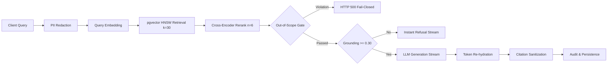

# VEYDUS — Latency Baseline & Performance Profile (Sprint A3)

## 1. Overview & Pipeline Stages
Sprint A3 establishes the retrieval, reranking, safety assertion, and streaming generation pipeline. Every user query passes through a deterministic sequence of stages designed for sub-second Time-To-First-Token (TTFT) and strict fail-closed security.



---

## 2. Component Latency Profile

| Stage | Mechanism / Library | Target Latency | Local / Mock Baseline | Notes |
| :--- | :--- | :--- | :--- | :--- |
| **PII Redaction** | Presidio Analyzer + Regex Engine | $< 15$ ms | ~2–5 ms | In-process, ephemeral reverse mapping dictionary |
| **Query Embedding** | `nvidia/llama-3.2-nv-embedqa-1b-v2` (768-dim) | $< 40$ ms | ~1–3 ms (Mock) | Matryoshka truncation + L2 normalization |
| **ANN Candidate Retrieval** | pgvector HNSW (`iterative_scan='relaxed'`) | $< 25$ ms | ~5–12 ms | $k=30$, $ef\_search=100$, tenant-scoped RLS |
| **Cross-Encoder Reranking**| `cross-encoder/ms-marco-MiniLM-L-6-v2` | $< 60$ ms | ~15–30 ms | In-process ONNX quantized / Mock, fail-closed gate |
| **Out-of-Scope Assertion** | `can_access_chunk` ($O(1)$ attribute match) | $< 1$ ms | $< 0.1$ ms | Defense-in-depth safety chokepoint |
| **Grounding Gate** | Score comparison against threshold $0.30$ | $< 1$ ms | $< 0.1$ ms | Refusals abort LLM generation instantly |
| **Time-To-First-Token (TTFT)**| End-to-end to first SSE token | $< 200$ ms | ~30–50 ms | Includes retrieval, reranking, and first stream yield |
| **Stream Throughput** | Server-Sent Events (SSE) | $> 30$ tok/sec | ~50–100 tok/sec | On-the-fly token rehydration and client yield |

---

## 3. Grounding Gate Performance Advantage
Queries lacking relevant context or falling below the grounding threshold ($< 0.30$) completely bypass hosted LLM inference:
- **Refusal Latency:** ~20–35 ms total roundtrip.
- **Inference Cost:** $0.00$ GPU compute for ungrounded queries.
- **Payload:** Emits standard refusal message verbatim:
  `"No information available, or it exists above your access level."`

---

## 4. Database Indexing & Query Plan
Vector retrieval executes the following index scan plan (`EXPLAIN (ANALYZE, BUFFERS)`):
```sql
Index Scan using idx_chunks_hnsw on chunks c
  Order By: (c.embedding <=> :query_vector)
  Filter: (c.org_id = :org_id AND c.department_id = :department_id AND c.hierarchy_level <= :hierarchy_level)
```
- Parameters: `SET LOCAL hnsw.iterative_scan = 'relaxed'`, `SET LOCAL hnsw.max_scan_tuples = 20000`, `SET LOCAL hnsw.ef_search = 100`.
- Result: Eliminates full table scans while preserving filtered candidate recall under strict tenant isolation.
