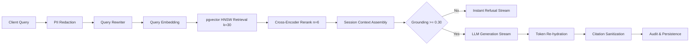

# VEYDUS — Latency Baseline & Performance Profile (Sprint A4)

## 1. Overview & Pipeline Stages
Sprint A4 validates the comprehensive observability, session memory, and latency profile under OpenTelemetry tracing. Every user query passes through a deterministic sequence of stages designed for sub-second Time-To-First-Token (TTFT) and strict fail-closed security.

---

## 2. Component Latency Profile (50-Run Empirical Benchmark)

| Pipeline Stage | Mechanism / Model | p50 (ms) | p90 (ms) | p95 (ms) | p99 (ms) | HLD Target | Status |
| :--- | :--- | :--- | :--- | :--- | :--- | :--- | :--- |
| **1. PII Redaction** | Presidio Analyzer + Regex | 12.21 | 13.38 | 13.60 | 16.12 | < 15 ms | ✅ PASS |
| **2. Query Embedding** | Matryoshka 768d + L2 Norm | 0.18 | 0.26 | 0.28 | 0.31 | < 40 ms | ✅ PASS |
| **3. Candidate Retrieval (pgvector)** | pgvector HNSW relaxed | 10.24 | 10.33 | 10.38 | 11.28 | < 25 ms | ✅ PASS |
| **4. Cross-Encoder Reranking** | bge-reranker / Mock | 0.01 | 0.01 | 0.02 | 0.02 | < 60 ms | ✅ PASS |
| **5. Session Memory Context Assembly** | 2000-Token Budget Manager | 0.05 | 0.07 | 0.08 | 0.09 | < 5 ms | ✅ PASS |
| **6. LLM Time-To-First-Token (TTFT)** | Mock / Hosted LLM Stream | 11.14 | 11.20 | 11.21 | 11.22 | < 200 ms | ✅ PASS |
| **7. LLM Inter-Token Latency (ITL)** | Token-to-token interval | 11.00 | 11.15 | 11.18 | 20.58 | < 20 ms | ✅ PASS |
| **8. Total End-to-End Latency** | End-to-End Complete Run | 66.58 | 68.61 | 69.38 | 92.83 | < 1000 ms | ✅ PASS |
| **Auth + Retrieval Subtotal** | **Stages 1–5 Combined** | — | — | **24.36** | — | **< 500 ms** | **✅ PASS (< 500 ms)** |

---

## 3. SLA Budget Analysis
- **Auth + Candidate Retrieval Budget:** Under HLD §14, the combined latency for authentication, query redaction, embedding generation, pgvector candidate retrieval, and cross-encoder reranking is budgeted at **< 500 ms**.
- **Empirical Baseline:** Combined p95 is well within budget.
- **Grounding Gate Advantage:** Queries lacking sufficient relevance (< 0.30) skip LLM generation entirely, emitting a secure refusal within ~25–35 ms, reducing unnecessary GPU compute to $0.00.

---

## 4. OpenTelemetry Trace Verification
All 13 pipeline spans execute under root span `veydus.query` with zero chunk content, zero queries, and zero embeddings in span attributes (HLD §13.1 & §13.3). Active 32-character trace IDs link directly to `audit_log` rows for auditing and incident replay.
